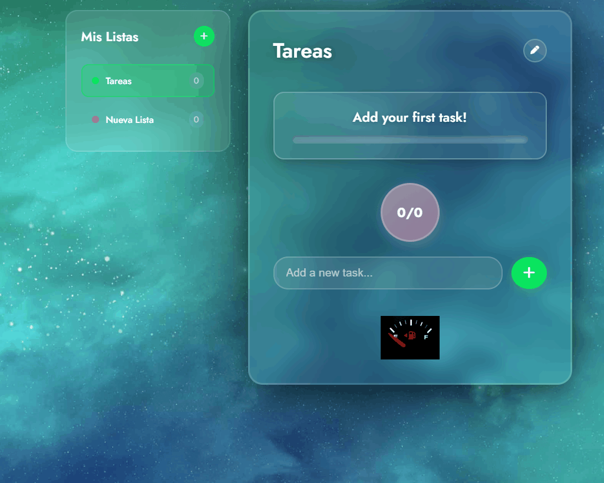

# 🌟 ToDo Culichi

A modern todo list application with an elegant interface and advanced features, built with **HTML5**, **CSS3**, and **Vanilla JavaScript**.

## 🌐 Live Demo

**[Try it here: https://byculichi.github.io/Todo-Culichi/](https://byculichi.github.io/Todo-Culichi/)**

---

## 📸 Screenshots

---

## ✨ Key Features

### 🎯 Task Management
- **Add tasks**: Intuitive interface to create new tasks
- **Mark as completed**: Checkbox system with smooth animations
- **Edit tasks**: Inline editing functionality
- **Delete tasks**: Deletion button with visual confirmation

### 📊 Progress Tracking
- **Dynamic progress bar**: Real-time progress visualization
- **Task counter**: Shows completed tasks vs. total (e.g., 2/5)
- **Contextual messages**: Smart feedback messages
- **Celebration animation**: Animated confetti when all tasks are completed

### 💾 Data Persistence
- **Local Storage**: Tasks are automatically saved in the browser
- **Auto-recovery**: Restores tasks when the page is reloaded

### 🎨 Modern Design
- **Cosmic theme**: Space background with glassmorphism effects
- **Responsive interface**: Adapts to different screen sizes
- **Smooth animations**: Fluid transitions and visual effects
- **Elegant empty state**: Decorative image when there are no tasks

---

## 🛠️ Technologies Used

- **HTML5** - Semantic and accessible structure
- **CSS3** - Modern styling with:
  - Gradients and glassmorphism effects
  - CSS animations and transitions
  - Responsive design with Flexbox
  - Google Fonts (Jost, Poppins)
- **JavaScript (Vanilla)** - Application logic including:
  - DOM manipulation
  - Event handling
  - Local Storage API
  - Dynamic animations

---

## 🚀 Getting Started

You can try the application by:
1. Visiting the [live demo](https://byculichi.github.io/Todo-Culichi/)
2. Or opening the `index.html` file directly in your favorite web browser

---

## 📱 Usability Features

- **Keyboard shortcuts**: Press Enter to quickly add tasks
- **Visual feedback**: Dynamic messages that guide the user
- **Interface states**: Different views based on task progress
- **Accessibility**: Accessible controls and keyboard navigation

---

## 🎉 User Experience

The application offers personalized motivational messages:
- `"Add your first task!"` - Initial state
- `"You have X pending task(s)"` - With uncompleted tasks
- `"You're doing great! X task(s) remaining"` - Partial progress
- `"Congratulations, you completed all your tasks! 🎉"` - All completed

---

## 👨‍💻 About the Project

This project is part of my personal portfolio, demonstrating skills in modern frontend development with standard web technologies. The application combines practical functionality with an attractive visual design and polished user experience.
